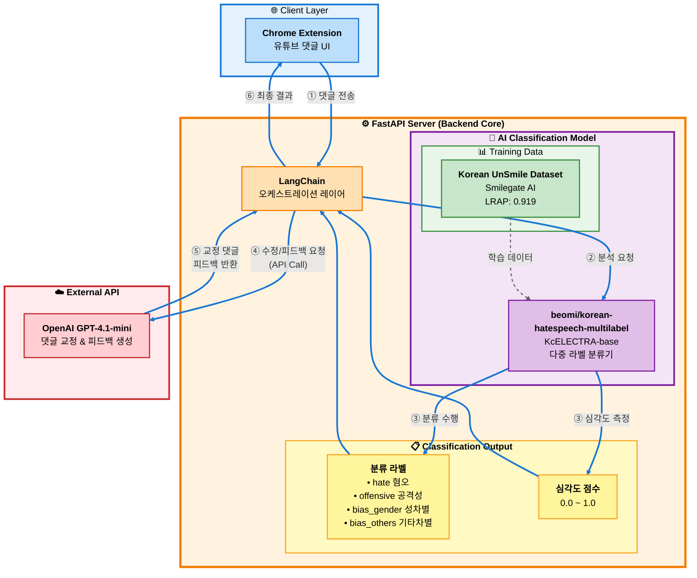
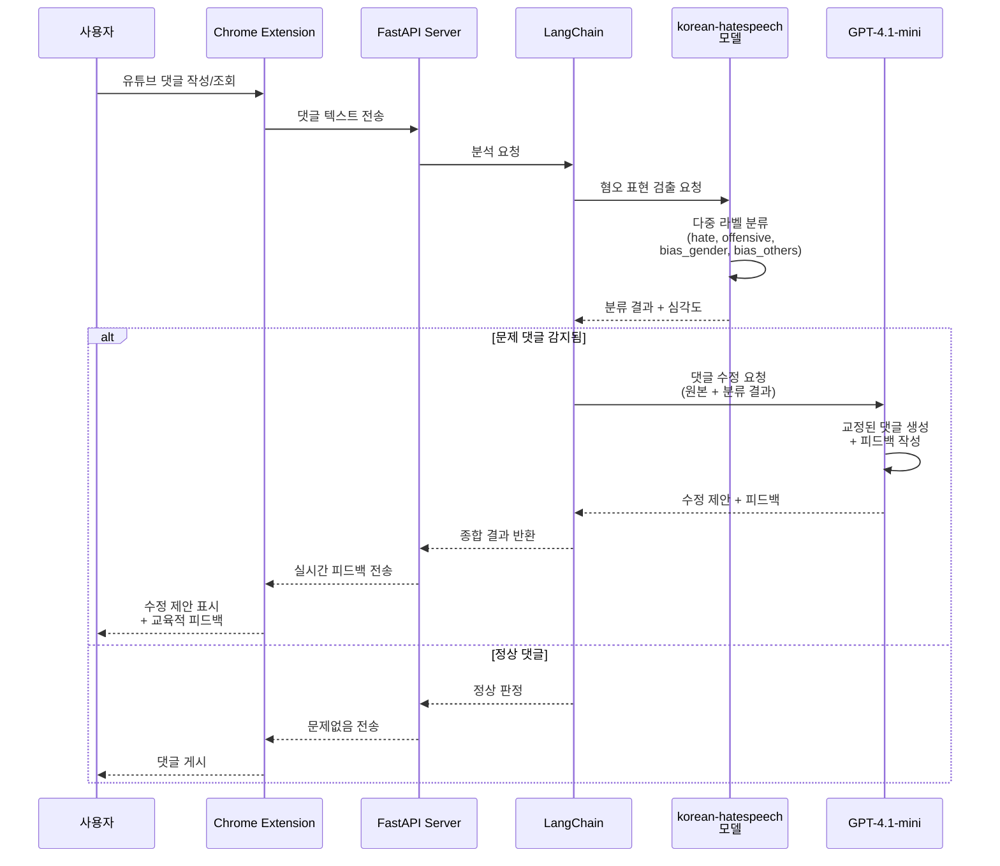
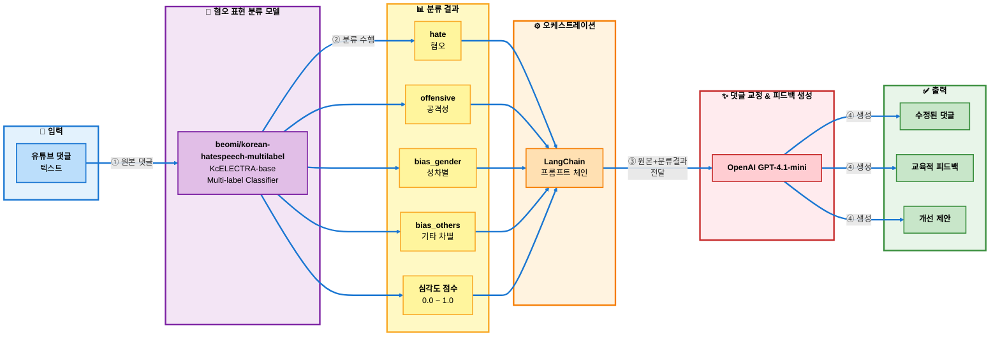

# Commento Backend
유튜브 댓글을 입력받아 혐오/공격성/차별 표현을 분류하고, 문제가 감지되면 AI가 댓글을 교정 및 교육적 피드백을 제공하는 백엔드 서버입니다.

# 시스템 아키텍쳐




# 서비스 처리 흐름도
- 댓글 분석 프로세스 시퀀스


# 데이터 처리 파이프라인
- AI 모델 처리 과정

# 실행 방법 - DockerHub Image
## 실행 환경
- Python 3.13
- FastAPI / Uvicorn
- LangChain
- HuggingFace beomi/korean-hatespeech-multilabel
- OpenAI GPT-4.1-mini API

## 환경 변수
- .env 파일을 준비합니다.
```bash
OPENAI_API_KEY=your_api_key
```
- OPENAI_API_KEY 는 필수입니다. 값이 없으면 GPT 피드백 생성 단계에서 오류가 발생합니다.

## Docker 이미지
- Docker Hub Repository: griotold/commento
    - https://hub.docker.com/repository/docker/griotold/commento/general     
- 최신 태그: 1.1.0
- latest 태그가 없으므로 반드시 태그를 명시해야 pull 됩니다.

## 배포 방법
### 1) 서버에 Docker 설치 확인
```bash
docker --version
```
- 설치가 안 되어 있다면 Docker를 먼저 설치합니다.

### 2) .env 파일 생성
- 아래 경로는 예시입니다.
```bash
mkdir -p ~/commento
nano ~/commento/.env
```

내용:
```bash
OPENAI_API_KEY=your_api_key
```
- 저장 후 종료합니다.

### 3) Docker Hub 에서 이미지 pull
```bash
docker pull griotold/commento:1.1.0
```

### 4) 컨테이너 실행
```bash
docker run -d \
  --name commento \
  -p 80:8000 \
  --env-file ~/commento/.env \
  --restart unless-stopped \
  griotold/commento:1.1.0
```

### 5) 배포 확인

```bash
## 컨테이너 상태 확인:
docker ps

## 로그 확인:
docker logs -f commento

## 서버가 정상 실행되면 Swagger 문서로 접속 가능합니다.
http://<PUBLIC_IP>/docs
```

### (선택) 컨테이너 중지/재시작/삭제
중지:
```bash
docker stop commento
```
재시작:
```bash
docker restart commento
```
삭제:
```bash
docker rm -f commento
```

## 트러블 슈팅
### 이미지 pull이 안 될 때
- 태그를 정확히 명시했는지 확인:
```bash
docker pull griotold/commento:1.1.0
```

### OpenAI 관련 에러가 날때
- .env 파일의 OPENAI_API_KEY 값이 올바른지 확인
- 컨테이너에 env가 주입되었느지 확인
```bash
docker exec -it commento printenv | grep OPENAI
```

### 외부 접속이 안 될 때
- 오라클 클라우드 Security List / NSG 에서 인바운드 80 포트가 열려 있는지 확인
